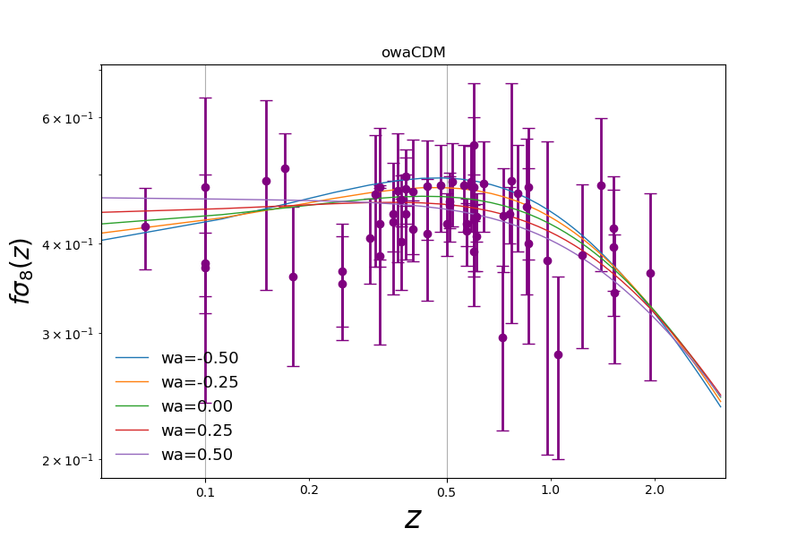

**Cosmological calculator**
============================

``SimpleMC`` has a cosmological calculator that allows to estimate several cosmological quantities given a model. This calculator is contained in the `CosmoCalc class <_modules/simplemc/CosmoCalc.html#CosmoCalc>`_.

Between the options to cosmological functions there are the Hubble parameter, BAO distances, :math:`f \sigma_8(z)`, the age of the Universe and distance modulus.

In ``test_calculator.py`` there is an example of the use of the ``CosmoCalc class``, where the chosen function is :math:`f \sigma_8(z)`. You can run this example as follows:

   .. code-block:: bash

      python test_calculator.py
      
and the output plot is the following:

