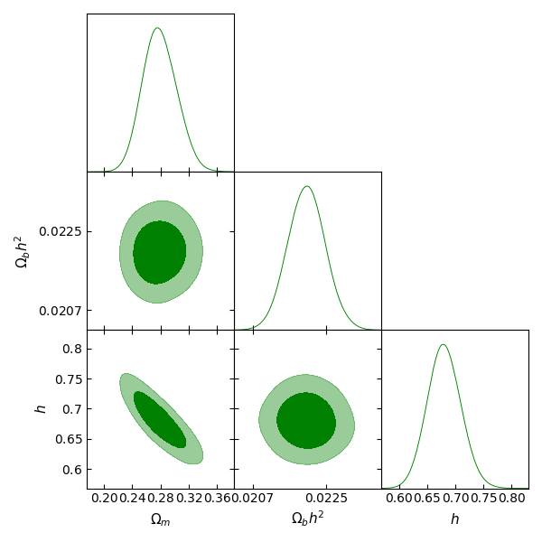

Plot the outputs
=================

[Section in process...]

``SimpleMC`` has the following alternatives to generate figures from the MCMC outputs:

  * :ref:`getdist`

  * :ref:`corner`

  * :ref:`simpleplot`

  * :ref:`fgivenx`

In the ``ini file`` you can set the option to plot the outputs as follows:

.. code-block:: bash

	[custom]
	...

	model = LCDM

	datasets = SN

	analyzer = mcmc

	; You can select only one of the following three options

	getdist = True

	corner = True

	simpleplot = True

	;True if you want to display and save the figure
	;False if only want to save the figure in your chainsdir

	showfig = True
	...

..  _getdist:

With getdist:
-------------

..  _corner:

With Corner:
---------------

.. figure:: img/LCDM_SN+HD_snest_0.6_corner.png

..  _simpleplot:

With Simple_Plot class
-----------------------

The **Simple_Plots class** reads the chains to draw with the chosen option.

.. figure:: img/simpleplotstriangle.png

..  _fgivenx:

With fgivenx
--------------

